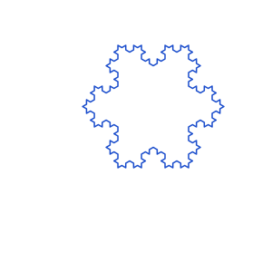
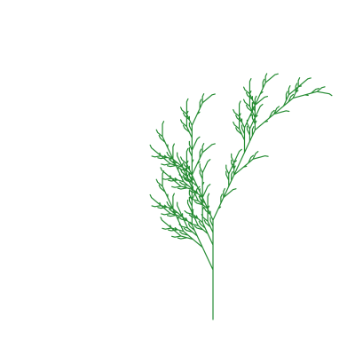

# vg/turtle — turtle graphics & L-systems

Generate vector line art from [L-systems](https://en.wikipedia.org/wiki/L-system)
and render it to compact SVG/PDF/canvas through
[`vg`](https://github.com/moonbit-community/vg).

An `LSystem` rewrites an axiom by per-symbol production rules; `render` walks the
resulting string as turtle commands and returns a single stroked `@vg.Image`.

**Commands** (other characters are ignored, so rewrite-only symbols like `X` are fine):

| symbol | action |
|---|---|
| `F` | step forward, drawing a line |
| `f` | step forward without drawing |
| `+` / `-` | turn left / right by `angle` radians |
| `[` / `]` | push / pop position+heading (for branching) |

## Koch snowflake



```mbt check
///|
test "koch snowflake" (it : @test.Test) {
  let sys = @turtle.LSystem::new("F++F++F", [('F', "F-F++F-F")])
  let img = @turtle.render(
    sys.expand(3),
    angle=3.14159265358979 / 3.0,
    step=5.0,
    color=@color.rgb(0.1, 0.3, 0.8),
    thickness=1.5,
  ).translate_img(58.0, 35.0)
  it.write(img.to_svg(300.0, 300.0))
  it.snapshot(filename="koch_snowflake.svg")
}
```

## Branching plant



```mbt check
///|
test "plant" (it : @test.Test) {
  let sys = @turtle.LSystem::new("X", [('X', "F+[[X]-X]-F[-FX]+X"), ('F', "FF")])
  let img = @turtle.render(
    sys.expand(5),
    angle=0.4363, // 25 degrees
    step=3.5,
    color=@color.rgb(0.15, 0.55, 0.2),
    thickness=1.2,
  ).translate_img(40.0, 160.0)
  it.write(img.to_svg(400.0, 400.0))
  it.snapshot(filename="plant.svg")
}
```
